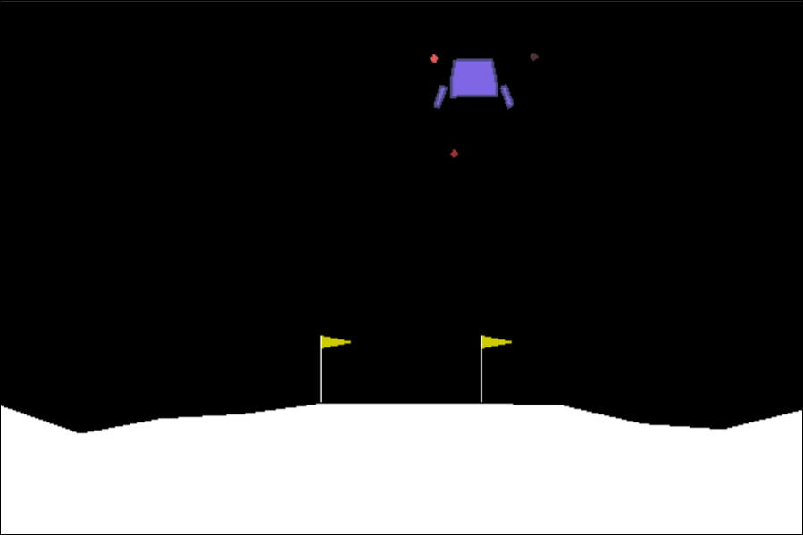
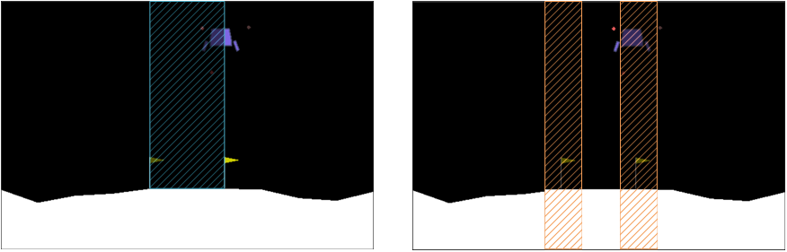

# Project - Case Studies of HCPA Synthesis 

## Installation

The project was developed using Python3, and you only need to download the project, but there are a few prerequisites before running：

- Python3.7.* (or high)
- graphviz (for drawing LDBA)
- gym (Luna-Lander environment)
- Pytorch (for deep learning)

## Environment Description

### The Discrete-State Case (5 × 4 grid-world)


### The Continuous-State Case (Luna-Lander)

#### Basic Description
This environment is a classic rocket trajectory optimization problem.
States in LunaLander environment is a 8-tuple, 
encodes the lander’s position, velocity, angle, angular velocity, 
and indicators for contact between the legs of the vehicle and the ground.
The range of values for the states is shown in the table below.

|              |                                                |
|:-------------|:-----------------------------------------------|
| Action Space | Discrete(4)                                    |
| Observation Shape | (8)                                       |
|Observation High| [1.5, 1.5, 5.0, 5.0, 3.14, 5.0, 1, 1, ]      |
|Observation Low| [-1.5, -1.5, -5.0, -5.0, -3.14, -5.0, 0, 0, ] |

And the four discrete actions are:   
* 0 - do nothing, 
* 1 - fire left orientation engine, direction = -1,
* 2 - fire main engine,   direction = 0,
* 3 - fire right orientation engine, direction = 1

The landing pad is always at coordinates (0,0). 
The coordinates are the first two numbers in the state vector. Landing outside of the landing pad is possible.



#### Other settings

We label the states whose position $(x, y)$ are in the blue shaded area 
and the velocity $|(v_x, v_y)|\leq 0.2$ 
and the angular velocity $|v_{\theta}| \leq 1.0$ as $a$, 
and the states crashed or out of screen range as $b$, 
the goal can be expressed in the LTL formula as $\varphi_2 = \lozenge \square a \wedge \square\neg b$.

The critical states are states whose position $(x, y)$ are in the orange shaded area
and the velocity $0.15 \leq |(v_x, v_y)|\leq 0.3$ 
and the angular velocity $0.5 \leq |v_{\theta}| \leq 1.5$, 



[//]: # (Solving the environment require an average total reward of over **200** over 100 consecutive episodes.   )
[//]: # (If lander moves away from landing pad it loses reward back. Episode finishes if the lander crashes or   )
[//]: # (comes to rest, receiving additional -100 or +100 points. Each leg ground contact is +10. Firing main   )
[//]: # (engine is -0.3 points each frame. Firing side engine is -0.03 points each frame.   )
[//]: # (Landing outside landing pad is possible. Fuel is infinite, so an agent can learn to fly and then land on   )
[//]: # (its first attempt. )
[//]: # (![]&#40;images/case_lunalander.png&#41;)

The policy function of the CPSA is the  function `get_CPS_action` in file
`main_deepQL_HCPS`.

## Usage  

### The Discrete-State Case (5 × 4 grid-world)


### The Continuous-State Case (Luna-Lander)
The environment file will be found in `./env/lunar_lander.py`. 

Train the human oracle:
```shell
$python3 main_reinforce_HPS.py
```
The training result will be stored in `./dir_chk/Reinforce_HPS`.

Train the switch oracle:
```shell
$python3 main_reinforce_DQQN_HCPS.py
```
The training result will be stored in `./dir_chk/Reinforce_HPS`.

Do tests in the CPSA:
```shell
$python3 Whatch_CPS_LTL.py
```

Do tests in the HPSA:
```shell
$python3 Whatch_HPS_LTL_Reinforce.py
```

Do tests in the HCPA:
```shell
$python3 Whatch_HCPS_LTL_Reinforce.py
```

[//]: # (Score **200** achieved in **688** episodes  )

[//]: # ()
[//]: # (![a]&#40;images/plot-LunaLander-v2-DQN-688epis.png&#41;)


### Watch the Trained Agent   
For both neural networks, _q_local_ and _q_traget_, we save the trained weights into checkpoint files    
with the extension _pth_. The corresponding files are saved into the directory _dir_chk_.    
Using notebook **WatchAgent-DQN.ipynb** we can load the trained weights and replay them.


